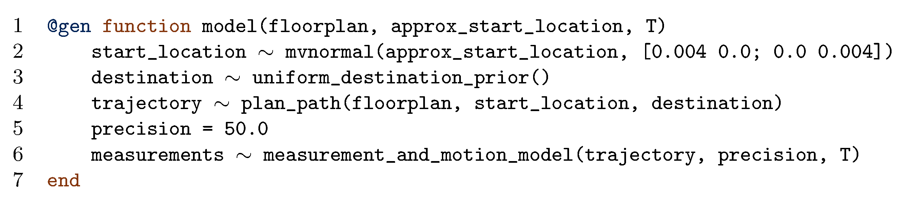
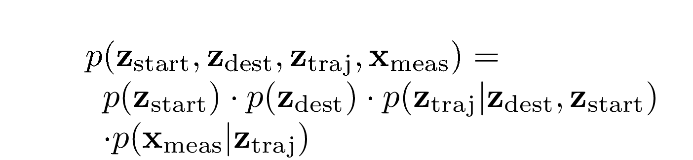

# tutorial_highlighter

Python package for generating PNGs of code and math with custom highlighted regions using LaTeX

## Installation

Ensure that the executables `convert` from [ImageMagick](https://imagemagick.org/index.php) and `pdflatex` are on the `PATH`.

Clone the repository, and install the Python package into your Python environment:

```
git clone git@github.com:probcomp/tutorial_highlighter.git
pip install tutorial_highlighter
```

## Usage

There are two functions provided, `render_code` and `render_math`.

### `render_code`

1. Create a string containing your code, with unique **tags** dispersed throughout (a string wrapped in `(*` and `*)`):
```python
model_code = """\
@gen function model((*1*)floorplan(*2*), (*3*)approx_start_location(*4*), T)
    (*5*)start_location(*6*) ~ (*7*)mvnormal((*8*)approx_start_location(*9*), [0.004 0.0; 0.0 0.004])(*10*)
    (*11*)destination(*12*) ~ (*13*)uniform_destination_prior()(*14*)
    (*15*)trajectory(*16*) ~ (*17*)plan_path(*18*)(floorplan, start_location, destination)(*19*)
    precision = 50.0
    (*20*)measurements(*21*) ~ (*22*)measurement_and_motion_model(*23*)(trajectory, precision, T)(*24*)
end"""
```

2. Create a list of all tags in the code (to facilitate error-detection):
```python
tags = [str(i) for i in range(1, 25)]
```

3. Indicate the set of regions (a pair of tags indicating the start and end) that should be highlighted.
Regions may not overlap, and one tag cannot be used in the definition of more than one region.
Both the start and end tags of a region must be on the same line.
For example, to highlight the `floorplan` argument, we use:
```python
regions = [("1", "2")]
```

NOTE: It is recommended to use more informative tags that are not simply numbers (as in this example), at the cost of being more verbose.

4. You provide listings settings and other LaTex prelude strings that should be included in the LaTeX file.
The listings settings must be a tuple of two elements where the first element is a `lstset` block that defines an `escapeinside` option, and the second element is a tuple containing the two escapeinside strings, e.g.:
```python
lstset = r"""
    \lstset{
      escapeinside={(@*}{*@)},
      basicstyle=\ttfamily\small,
      numbers=left
    }
escapeinside = (r"(@*", r"*@)")
listings_settings = (lstset, escapeinside)

prelude = r"""
    % empty for now
"""
```

5. Then, render the code listing with highlighting to a PNG file:
```python
import tutorial_highlighter

tutorial_highlighter.render_code(
    model_code, tags, regions, ", listings_settings,
    varwidth_frac=1.05, user_prelude=prelude)
```

(You may need to adjust `varwidth_frac` to ensure your code is not cut off on the right).

You can generate many frames of a given code block, with different highlighting, e.g.:



### `render_math`


